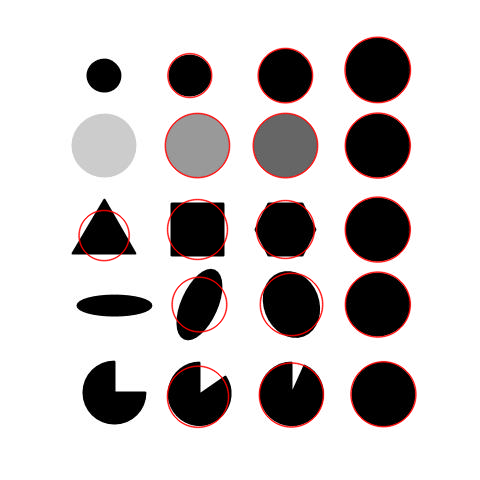

# opencv-skills

## What is it?
Bu repo Bilgisayarlı Görü (Computer Vision) yetenekleri geliştirmek için yaratılmıştır.

Hope this might be useful to someone! :-)

## Who am I?
>Hi 👋

## What to do next:
- [x] readme yaratılacak
- [x] requirements yaratılacak(pipreqs) – her kütüphane ihtiyacında güncellenecek
- [x] output ve data şeklinde klasor yapısı olacak
- [x] main başlayacak
- [x] config dosyası olacak ilk veriler oradan alınacak
- [x] video operasyonu var ise bağımsız class olacak
- [x] tool sınıfı olacak ıse yarar hesaplamalar orda duracak
- [x] drawing sınıfı olacak o sayede tüm çizimler yapılacak
- [ ] Her CV çıktısını readme ekle

## Overview

### Projects

#### Simple Background Estimation in Videos

- **Summary:** We can assume most of the time, every pixel sees the same piece of the background because the camera is not moving. Occasionally, a car or other moving object comes in the front and obscure the background.
- **Keywords:** Background Estimation
<table style="width:100%">
  <tr>
    <th>
      

           
            <a href="./background_estimation.py" >(background_estimation.py)</a>
      

    </th>
  </tr>
</table>

#### Background Subtraction with OpenCV and BGS Libraries

- **Summary:** WSteeping into the idea behind these CV-systems we can observe that in most cases the initial steps contain background subtraction (BS), which helps to obtain relatively rough and rapid identifications of the objects in the video stream for their further subtle handling. In the current post, we are going to cover several noteworthy algorithms in terms of accuracy and processing time BS methods: SuBSENSE and LSBP-based GSoC method.
- **Keywords:** Background Estimation
<table style="width:100%">
  <tr>
    <th>
      

           
            <a href="./background_subtraction_opencv.py" >(background_subtraction_opencv.py)</a>
      

    </th>
  </tr>
</table>

#### Blob Detection Using OpenCV

- **Summary:** 
- **Keywords:** 
<table style="width:100%">
  <tr>
    <th>
      

           
            <a href="./blob_detection.py" >(blob_detection.py)</a>
      

    </th>
  </tr>
</table>

#### Color spaces in OpenCV

- **Summary:** 
- **Keywords:** 
<table style="width:100%">
  <tr>
    <th>
      

           
            <a href="./color_spaces.py" >(color_spaces.py)</a>
      

    </th>
  </tr>
</table>

#### Contour Detection using OpenCV

- **Summary:** 
- **Keywords:** 
<table style="width:100%">
  <tr>
    <th>
      

           
            <a href="./contour_detection.py" >(contour_detection.py)</a>
      

    </th>
  </tr>
</table>

#### Cropping an Image

- **Summary:** 
- **Keywords:** 
<table style="width:100%">
  <tr>
    <th>
      

           
            <a href="./cropping_an_image.py" >(cropping_an_image.py)</a>
      

    </th>
  </tr>
</table>

#### Edge Detection

- **Summary:** 
- **Keywords:** 
<table style="width:100%">
  <tr>
    <th>
      

           
            <a href="./edge_detection.py" >(edge_detection.py)</a>
      

    </th>
  </tr>
</table>

#### Hough Transform-Line&Circle

- **Summary:** 
- **Keywords:** 
<table style="width:100%">
  <tr>
    <th>
      

           
            <a href="./hough_circles.py" >(hough_circles.py)</a>
      

    </th>
  </tr>
  <tr>
    <th>
      

           
            <a href="./hough_lines.py" >(hough_lines.py)</a>
      

    </th>
   </tr>
</table>

#### Annotating Images

- **Summary:** 
- **Keywords:** 
<table style="width:100%">
  <tr>
    <th>
      

           
            <a href="./image_annotating.py" >(image_annotating.py)</a>
      

    </th>
  </tr>
</table>
 
#### Image Filtering Using Convolution in OpenCV

- **Summary:** 
- **Keywords:** 
<table style="width:100%">
  <tr>
    <th>
      

           
            <a href="./image_filtering.py" >(image_filtering.py)</a>
      

    </th>
  </tr>
</table>

#### Image Resizing with OpenCV

- **Summary:** 
- **Keywords:** 
<table style="width:100%">
  <tr>
    <th>
      

           
            <a href="./image_resizing.py" >(image_resizing.py)</a>
      

    </th>
  </tr>
</table>

#### Image Rotation Using OpenCV

- **Summary:** 
- **Keywords:** 
<table style="width:100%">
  <tr>
    <th>
      

           
            <a href="./image_rotation.py" >(image_rotation.py)</a>
      

    </th>
  </tr>
</table>

#### Image Translation Using OpenCV

- **Summary:** 
- **Keywords:** 
<table style="width:100%">
  <tr>
    <th>
      

           
            <a href="./image_translation.py" >(image_translation.py)</a>
      

    </th>
  </tr>
</table>

